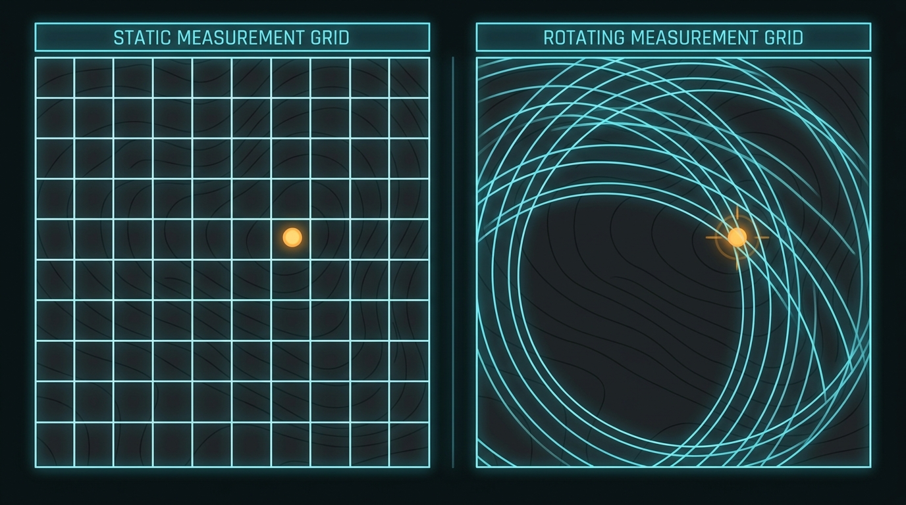
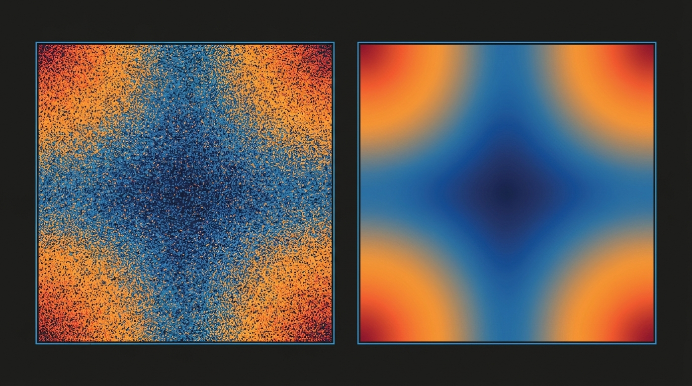
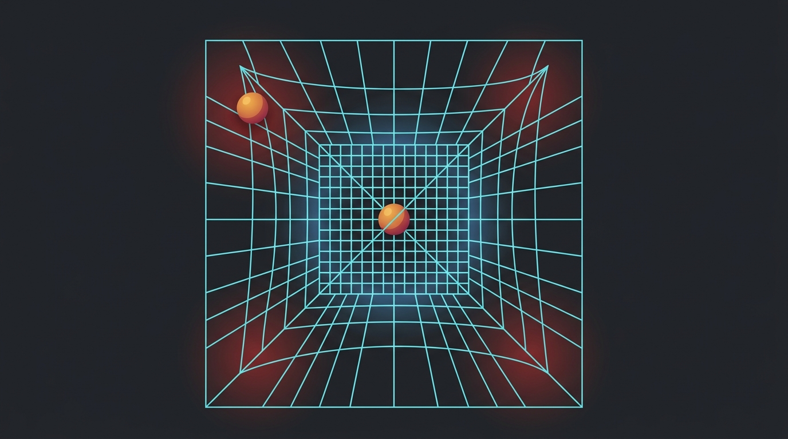

# Learning: how Grid Probe got built

*What follows is the thinking behind `apps/gridprobe`, written the way I'd
explain it across a table rather than the way a spec would.*

---

## Step 1 — The approach, and why

Your ask had four nouns in it: a grid, a rotation speed, a line width, an
opacity. And then one purpose: *to find blind spots caused by distortion.*

The four nouns are trivial. The purpose is the whole job. So the first thing I
did was refuse to start coding and instead ask a question I actually couldn't
answer from the request: **where does this live?** In this repo there was a mind
map app whose 3D view already has projection warping — a rotating grid there
would mean something quite specific and different. You said standalone, which
settled it: a general-purpose optical test card, the sort of thing you'd throw
full-screen at a monitor, a VR lens, a projector, or a camera feed.

That one answer determined everything downstream. Standalone means the grid is a
*probe*, not decoration. And a probe has to answer a question, not just look
like an instrument.

So here was my starting point, and I want to be honest that it's the thing that
made this project worth doing: **a rotating grid is only half a tool.** It shows
you a warp — a straight line stays straight, a bent one sweeps, and your eye is
enormously better at catching motion than at catching static curvature. That's
real. But "find blind spots" is a measurement claim, and eyes don't measure. So
I built two things that share one description: the visual instrument you look
at, and a scoring layer that says *how* blind, *where*, and *how big a thing
could hide there*.



*A still grid asks one question. Turning it asks from every direction.*

<!-- Nano Banana Pro (gemini-3-pro-image-preview), 16:9 — prompt kept for reproducibility:
A precise technical diagram split into two labelled panels side by side, comparing a still measurement grid with a rotating one laid over a gently warped dark surface. In the left panel a static pale-cyan square grid sits over the warped surface and a small bright object rests unnoticed in the wide space between two lines; in the right panel the same grid is shown mid-rotation with soft motion-arc trails sweeping through several angles, and the same object is now crossed by a line and clearly caught. Rendered in a clean flat vector infographic style on a near-black charcoal background, with crisp thin luminous cyan and amber linework and no text labels. Lit by a soft even glow that comes from the lines themselves rather than any outside source. The composition is a wide flat two-panel comparison seen straight on, with a thin vertical divider between the panels. Color palette emphasizes deep charcoal black, luminous cyan, and a single warm amber accent. The mood is calm, exact, and instrument-like.

Midjourney equivalent:
technical infographic diptych, static square measurement grid on the left with a small amber object hidden between the lines, the same grid rotating on the right with sweeping arc trails catching the object, warped dark surface beneath, luminous cyan linework on near-black charcoal, flat vector style, even internal glow --ar 16:9 --style raw --v 7
-->


## Step 2 — The roads not taken

This is where I learned the most too, so let me be specific.

**Rejected: coverage.** My first instinct was the obvious one — accumulate which
pixels the grid lines ever touch during a full rotation, and call the untouched
ones blind. I nearly built it. Then I did the geometry in my head and it fell
over: a single grid line at distance *d* from the centre, rotated a full turn,
sweeps every point at radius ≥ *d*. The line through the centre sweeps
*everything*. So the union over a full turn is the entire plane, and "never
covered" is the empty set. The metric would have returned zero blind spots on
every input, forever, and it would have looked like it was working.

This is the most useful thing in this whole document: **a metric that can only
return one answer is indistinguishable from a working metric until you check.**
I caught it by arithmetic before writing a line. If I'd written it first, the
green output would have been very convincing.

**Rejected: rasterise-and-count.** The salvage of the above — sample 48 rotation
angles, draw the grid into a low-res buffer each time, count touches per cell.
I actually built this one. It ran, produced numbers in roughly the right places,
and looked like static. More on that in step 6.

**Rejected: an inherent-blind-spot form.** I briefly worried that the polar
form's spokes, which spread apart with radius, would swamp the distortion
signal. Then I checked: the concentric rings cap the gap at half a pitch
regardless, so polar behaves like every other form. Worth noting because I was
about to write a caveat into the README that would have been *wrong*, and only
running the numbers stopped me.

**Rejected: geometric mean of the two stretches.** I'll come back to this in
step 6 — it's the subtlest error I made and the one an expert would look for
first.

## Step 3 — How the pieces fit

Five files, and the shape is the point:

```
distort.js  →  the lens        (radius in, radius out, and the two stretches)
grid.js     →  the grid        (forms, as families of lines/rings/spokes)
analyze.js  →  the measurement (sweep profile → blind-spot map)
render.js   →  the picture     (backdrop, grid, field, markers)
app.js      →  the wiring      (state, controls, the loop)
```

The load-bearing decision is in `grid.js`: **each form is described exactly
once**, as a list of families, and both the renderer and the analyser read that
same description. The renderer turns families into polylines; the analyser turns
them into distance-to-nearest-line. They cannot drift apart.

Think of it like a blueprint that both the builder and the inspector work from.
If the inspector had their own copy — say, a hard-coded "square grids leave gaps
of p/2" — then the day someone adds a hexagonal form, the inspector confidently
certifies a building it has never seen. Every measurement bug I've watched
people chase in tools like this traces back to two descriptions of one thing.

The rest follows a strict dependency order, no cycles: the lens knows nothing
about grids, the grid knows nothing about lenses, and the analyser is the only
thing that knows both.

## Step 4 — Tools and methods, and why these

**Plain JavaScript, IIFE modules, no build step.** Not my aesthetic preference —
it's what `apps/mindmap` already does in this repo, and the tests
(`tests/mindmap/model.test.js`) `require()` those browser files directly in Node
because they hang themselves off a global. Matching that meant my maths got a
19-test Node suite for free, no bundler, no jsdom, no ceremony. Had I reached for
ES modules or React, I'd have bought a build step and lost the ability to test
the geometry headlessly in 600ms.

**Canvas over SVG.** Distorted grid lines are polylines with ~160 points each,
and there can be 80 of them, redrawn 60 times a second. SVG would mean 13,000
DOM nodes. Canvas is a for-loop.

**Brown's radial model for the distortion.** This is the standard in camera
calibration (it's what OpenCV fits), so `k1` and `k2` mean the same thing here as
in every calibration file you'll ever meet. Inventing my own warp would have made
the sliders unshareable.

**Playwright with the pre-installed Chromium** to actually drive the thing —
press every key, click the probe, read the readout back. Not screenshots as
decoration: screenshots as the step where I found two bugs I'd never have found
by reading the code.

## Step 5 — Tradeoffs

**Precision vs. legibility, and I chose legibility with a reason.** The raw
measurement genuinely ripples with radius — I'll explain why in step 8 — by up to
18%. I smooth it with a max over ± one nominal gap. That *is* throwing away real
signal. I did it because those bands belong to the grid, not to the lens under
test, and a user seeing rings will blame their monitor. The justification I'd
defend: anything big enough to be worth catching spans a band of radii rather
than sitting on one exact circle, so it meets the worst gap anywhere in that
band. That's physics, not cosmetics. But it *is* a choice, and it's flagged in
the README rather than buried.

**Exactness vs. generality.** The map models radial distortion only. Tangential
(decentering) terms, projector keystone, and panel defects are all outside it.
I could have added them; instead I added an image backdrop so you can find those
by eye, and said plainly in the README that the map can't score them. A tool
that quietly scores what it can't model is worse than one that admits the gap.

**On-demand vs. live measurement.** The map takes ~30ms (~130ms for moiré). I
could have made it live at 60fps by dropping resolution. Instead it's debounced
110ms after the last control change, so the animation never stutters and the
measurement is full-resolution. Speed, colour and opacity deliberately *don't*
trigger a remeasure — they can't move a blind spot, so they never pay for one.

**Scope.** I added things you didn't ask for: four forms, an off-axis optical
centre, an image backdrop, a pinned probe. Each earns itself — moiré is the most
sensitive form by a wide margin, the image backdrop turns this from a simulator
into a measuring instrument, off-axis is where real lenses actually live. I did
*not* add: tangential distortion, video capture, multi-monitor. Those are V2
problems.

## Step 6 — The mess

Three real wrong turns. None of them are embarrassing; all of them are where the
learning is.

**The speckle.** I built the sampled version — per cell, the max gap over 48
rotation angles — and it rendered as orange static over a blue field. My first
reaction was "the colour ramp is wrong". It wasn't. The estimator was. As you
move outward, a point sweeps through many grid cells per degree, so whether 48
discrete samples happen to catch the moment it sits at a cell centre is a coin
flip. The map was measuring my sampling, not the lens.

The fix wasn't more samples. It was noticing a symmetry: **turning the grid by θ
and looking at a fixed point is identical to holding the grid still and moving
the point by −θ.** So the set of gaps a point ever sees depends *only* on its
distance from the centre of rotation. That collapses a two-dimensional
per-pixel simulation into a one-dimensional profile — 256 radii instead of
40,000 cells, densely sampled instead of thinly, exact instead of noisy. Four
times faster *and* correct. Symmetry usually pays twice like that.

**The averaging mistake.** Distortion doesn't stretch things by one number; it
stretches radially by `1 + 3k₁r² + 5k₂r⁴` and around the circle by
`1 + k₁r² + k₂r⁴`. Those differ a lot. My first version took the geometric mean
of them — defensible-sounding, it's the square root of the area scale. It's also
wrong for this question. A *rotating* grid presents its gaps in every
orientation, which means the worst case takes the **larger** of the two, not
their average. The mean understated a pincushion corner by 11% at k₁ = 0.2 and
17% at k₁ = 0.5. A safety margin that's quietly 17% optimistic is the exact
failure mode this tool exists to prevent.

**The fudge I got caught on.** While chasing the speckle I wrote
`Math.max(worst, prev * 0.999)` — a running max with a hand-tuned decay, to
smooth the curve. It was a hack with no justification and I knew it when I typed
it. Then I wrote a test asserting the profile never dips, and it failed. Digging
in, I found the dips are **real and large** — 18%, not noise — because whether a
circle of a given radius threads through cell centres is arithmetic, not optics.
So the fudge was papering over a genuine phenomenon with a magic number that
happened to be a bit too small anyway. It got replaced by the windowed max from
step 5, which has an actual argument behind it, and by a test that asserts *both*
that the raw curve bands and that the widening removes it.

**The small stuff**: a `#panel label { display: block }` rule was overriding
`[hidden]` (specificity — id selector beats the attribute's UA default), so the
polar-only "Spokes" slider showed on every form. Only a screenshot caught it. And
the barrel-distortion grid was drawing past the fold radius where the model stops
being a map, giving a scalloped edge that looked like a rendering bug but was
the model politely screaming.



*Same lens, same frame. Left is what sampling measured; right is what the symmetry computes.*

<!-- Nano Banana Pro (gemini-3-pro-image-preview), 16:9 — prompt kept for reproducibility:
A precise technical diagram comparing two rendered heat maps of the same rectangular frame side by side, the left one noisy and the right one smooth. The left map is covered in scattered orange and blue speckled dots like television static, while the right map shows the same underlying pattern as a clean continuous radial gradient running from cool deep blue in the centre out to warm orange and red at the corners. Rendered in a clean flat vector infographic style on a near-black charcoal background with thin luminous borders around each map and no text labels. Lit by an even internal glow with no cast shadows. The composition is a wide flat side-by-side comparison seen straight on, the two frames equal in size with a narrow gap between them. Color palette emphasizes charcoal black, deep blue, and warm orange to red. The mood is analytical and quietly satisfying, the visual equivalent of noise resolving into signal.

Midjourney equivalent:
technical infographic diptych, two heat maps of the same rectangular frame, left covered in orange and blue speckled static, right a clean continuous radial gradient from deep blue centre to warm red corners, thin luminous borders, flat vector style on near-black charcoal, even internal glow --ar 16:9 --style raw --v 7
-->


## Step 7 — What I'd want told to me next time

- **Before you build a metric, ask what it returns on a trivial input.** Zero
  distortion should score exactly ×1. It does — 0.993, and that 0.7% is the
  measurement's own noise floor, which is worth knowing. If a metric can't
  return a boring answer on a boring input, it can't return a trustworthy one on
  an interesting one.
- **Symmetry before optimisation.** I could have made the speckled version fast
  with typed arrays and workers, and it would have been fast and wrong. Ten
  minutes of thinking about what stays invariant beat any amount of profiling.
- **When you write a magic number, write the test that will catch it.** The
  `0.999` survived exactly as long as it took me to write an assertion about the
  property it was faking.
- **Anisotropy is where averages go to lie.** Whenever a thing has different
  behaviour in different directions, ask whether your question wants the average
  or the extreme. Worst-case questions almost always want the extreme.
- **Drive the UI, don't just read it.** Two bugs here were invisible in the
  source and obvious in a screenshot.
- **Name the thing you can't measure.** The README says plainly that barrel
  distortion doesn't produce blind spots, that the rings you may see are the
  grid's own, and that tangential distortion is out of scope. Every one of those
  costs a little credibility up front and buys a lot of it later.

## Step 8 — What an expert would notice

Four things a beginner would walk past:

**The direction of the map matters.** Screen → ideal, not ideal → screen. To
score a *screen* cell you must undistort it to find where it really sits on the
grid, which needs an inverse of a cubic-in-radius polynomial. Getting this
backwards produces a map that looks plausible and is wrong everywhere off-centre.

**Barrel distortion folds.** Past a certain radius, `rd = ru(1 + k₁ru²)` stops
increasing and turns back on itself — the derivative hits zero. It isn't a
function you can invert there; a lens that strong forms no image out there at
all. A beginner's Newton solver would converge onto the wrong branch and return
confident nonsense in the frame corners. I build the inverse from a table over
the monotone stretch only, so a lookup that runs off the end returns an honest
`NaN`, and the map paints that region grey with a number attached ("26% of the
frame unmapped"). The grid drawing clips to the same circle, so what you see and
what gets scored agree.

**The bands are the grid, not the lens.** A rotating grid's coverage genuinely
ripples with radius. An expert sees concentric rings in a diagnostic output and
asks "is that my instrument?" before "is that my lens?" — and, crucially, the
tool should have already answered.

**The centre is always over-probed.** The middle of a rotating grid barely moves
in grid space, so it always scores well. That's a property of rotating, not a
finding about your display, and reading it as "the centre is fine" is exactly
backwards.



*The blind spot is not where the grid is missing. It is where the grid got wider than the thing you are looking for.*

<!-- Nano Banana Pro (gemini-3-pro-image-preview), 16:9 — prompt kept for reproducibility:
A precise technical diagram of a single square measurement mesh drawn in thin luminous cyan lines, stretched and pulled apart toward the corners of the frame so the cells near the edges are far larger than the small tight cells in the middle, with one small warm amber sphere resting comfortably inside a widened corner cell without touching any line, and a matching amber sphere in the centre that is crossed by lines on every side. A faint red glow pools in the stretched corner regions and a cool blue glow gathers in the tight centre. Rendered in a clean flat vector infographic style on a near-black charcoal background with no text labels. Lit by a soft internal luminescence from the mesh itself. The composition is a wide flat view looking straight down onto the mesh, perfectly centred and symmetrical. Color palette emphasizes charcoal black, luminous cyan, cool blue, and warm amber shading to red. The mood is a quiet warning, precise rather than alarming.

Midjourney equivalent:
technical infographic, a square measurement mesh in thin luminous cyan stretched wide toward the corners and tight in the middle, one amber sphere resting untouched inside a widened corner cell, another crossed by lines at the centre, faint red glow in the stretched corners and cool blue in the tight centre, flat vector style on near-black charcoal --ar 16:9 --style raw --v 7
-->


## Step 9 — What carries over

**The two-descriptions bug is everywhere.** Any time a system has a *doer* and a
*checker* — a renderer and a validator, a serialiser and a schema, a migration
and a rollback — the interesting bugs live in the gap between their two ideas of
the same thing. The fix is always the same shape: one description, two readers.

**Sampled estimators lie quietly.** They don't crash. They return numbers in
roughly the right range. Any time you're approximating a max or a worst case by
sampling, ask what the true thing is and whether some symmetry lets you compute
it instead. This applies to load testing, to Monte Carlo pricing, to A/B tests —
anywhere "we tried it 48 times and took the worst" stands in for a real bound.

**Average vs. worst is a decision, not a detail.** Latency, capacity, safety
margins, anything with a direction to it. The average is almost always the easier
number and almost always the wrong one for a risk question.

**Motion makes small differences legible.** The moiré form is the sharpest thing
in this tool — two grids counter-rotating produce fringes that move far faster
than the warp causing them, so a distortion too small to see becomes a pattern
crawling across the frame. That's a general trick: when a signal is below your
resolution, find a way to make it *beat against* something, and read the beat
instead. Vernier scales, heterodyne radio, stroboscopes, and phase-contrast
microscopy are all the same move.

**Documenting the limits is part of the deliverable.** The README's list of
things not to trust took maybe twenty minutes and is the difference between a
tool someone uses once and a tool someone relies on.

---

*A last honest note: the thing you asked for — a grid that turns, with settable
speed, width and opacity — is about 200 lines. The other 900 are the difference
between something that looks like an instrument and something that is one.*
