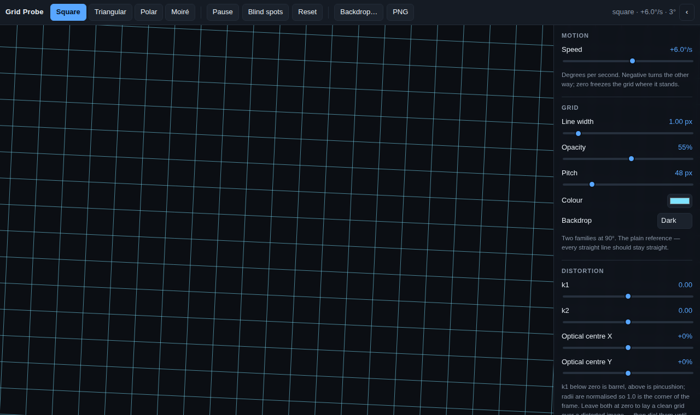
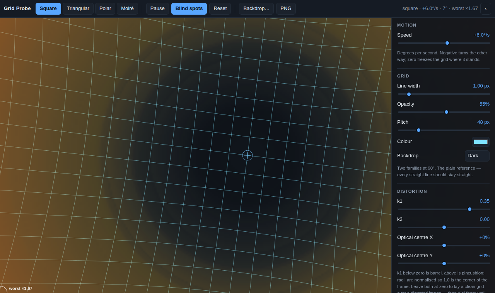
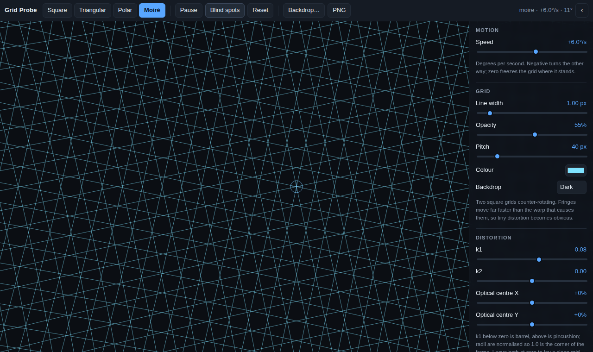

# Grid Probe

A grid that turns, laid over whatever you point it at, to find the places
distortion has left blind. No build step, no dependencies — plain HTML, CSS and
five small scripts drawing on a canvas.

| Clean | Pincushion, with the blind-spot map | Moiré fringes |
|---|---|---|
|  |  |  |

## Run it

```bash
open apps/gridprobe/index.html        # macOS; or just double-click the file
make gridprobe                        # or serve it on http://localhost:8081
make test-gridprobe                   # the maths, without a browser
```

## Why a grid has to turn

A still grid only ever asks one question: *is anything sitting on these lines?*
Everything between them is unexamined, and a distortion that quietly widens the
mesh in one corner looks exactly like a grid that was always that coarse there.

Turning the grid asks the question from every direction. Two things fall out of
that, and they are the whole tool:

- **You can see the warp.** A straight line stays straight under rotation. A
  bent one sweeps, and the eye catches a sweeping bend far more readily than a
  static one. At **Moiré** the two counter-rotating grids beat against each
  other, and the fringes move much faster than the warp that causes them — a
  distortion too small to see directly becomes a pattern crawling across the
  frame.
- **You can measure the blind spots.** Rotating puts the mesh's gaps in every
  orientation, so the worst case is well defined rather than a matter of how you
  happened to lay the grid down.

## The controls

| | |
|---|---|
| **Speed** | Degrees per second, either way. Zero freezes the grid where it stands. Slow (a few °/s) is for reading fringes; fast is for catching a bend by eye. |
| **Line width** | Sub-pixel widths are deliberate — a hairline probes finely and shows aliasing that a fat line hides. |
| **Opacity** | Turn it down to read what is underneath, up to read the grid. |
| **Pitch** | The mesh spacing, and with it the size of thing you are looking for. |
| **Form** | Square, triangular, polar, moiré. |
| **k1 / k2** | The distortion, normalised so radius 1.0 is the corner of the frame. Below zero is barrel, above is pincushion. |
| **Optical centre** | Off-axis distortion, as a percentage of the half-frame. Blind spots crowd to the far side of a shifted centre. |

## Two ways to use it

**Simulate.** Leave the backdrop plain, dial in k1 and k2, and watch what that
lens does to a straight line and to the mesh's coverage.

**Measure.** Drop a screenshot or a photo of the display you are testing onto
the page (or use **Backdrop…**), leave k1 and k2 at zero, and lay the clean grid
over it. Then dial k1 and k2 until the *image's* lines and the grid's agree.
Where they agree, you have read off the distortion, and the blind-spot map is
now the map of the real thing rather than of a model.

## What the blind-spot map means

Press **B**. Every cell of the frame is scored by the widest gap that opens
around it during a full turn, divided by the gap an undistorted grid of the same
pitch would leave. **×1 is as good as a clean grid. ×2 means something twice as
big can hide there.** Blue is tighter than nominal, clear is nominal, hot is
blind. Grey is a region a lens this strong forms no image in at all.

Two pieces of arithmetic do the work, and both are worth knowing:

- **The sweep depends only on radius.** Turning the grid by θ and looking at a
  fixed point is the same as holding the grid still and moving the point by −θ.
  So the set of gaps a point ever sees depends only on how far it sits from the
  centre of rotation — a one-dimensional profile, not a per-pixel simulation.
  That is what makes the map exact instead of a speckled estimate. (Moiré is the
  exception: its two grids turn opposite ways, so its profile sweeps bearing
  too.)
- **The worst case takes the larger stretch, not the average.** Distortion
  stretches a distance by a factor that depends on which way it points — radially
  by `1 + 3k₁r² + 5k₂r⁴`, around the circle by `1 + k₁r² + k₂r⁴`. A rotating
  grid presents its gaps in every orientation, so the blind spot is set by the
  larger of the two. Averaging them, which is the obvious move, understates the
  worst corner of a pincushion lens by 11% at k₁ = 0.2 and 17% at k₁ = 0.5.

### Things worth knowing before you trust a number

- **Barrel distortion does not make blind spots.** It crowds the periphery, so
  it scores at or under ×1 everywhere. What it does instead is refuse to form an
  image past a certain radius, which the map greys out and the grid stops at.
  Pincushion is the one that opens the mesh, and it opens it at the rim.
- **The map is about the lens, not the pitch.** Halve the pitch and the ratio
  barely moves, while the gap in pixels halves. The ratio tells you how much
  worse this corner is than the middle; the pixel figure next to it tells you how
  big a thing can actually hide.
- **The rotating grid has faint bands of its own.** Whether a circle of a given
  radius threads through cell centres is arithmetic, not optics. The raw sweep
  ripples by up to about 18% because of it. The profile is widened by a max over
  ± one nominal gap — justified, because anything big enough to worry about spans
  a band of radii rather than one exact circle — which cuts the ripple to a few
  percent. Faint rings that survive that are the grid, not your lens.
- **The middle is always the best-covered place**, because it barely moves in
  grid space while everything turns around it. That is a property of rotating,
  not a finding about the display.
- **This models radial distortion only.** Tangential (decentering) terms,
  keystone from an off-axis projector, and panel-level defects are outside it.
  Use the image backdrop for those: the grid still finds them by eye even though
  the map cannot score them.

## Keys

| | |
|---|---|
| `1` `2` `3` `4` | square / triangular / polar / moiré |
| `Space` | pause and resume |
| `B` | blind-spot map |
| `[` `]` | slower / faster |
| `−` `+` | pitch |
| `H` | hide the controls, for a full-frame probe |
| `R` | back to defaults |

Click anywhere to pin a probe: it reports the worst gap at that exact point and
draws it at true size, so you can see what "×1.7" actually looks like.

## The files

| | |
|---|---|
| `js/distort.js` | Brown's radial model, its two directional stretches, and the inverse |
| `js/grid.js` | the four forms, as families of lines, rings and spokes |
| `js/analyze.js` | the sweep profile and the blind-spot map |
| `js/render.js` | one draw path: backdrop, grid, field, markers |
| `js/app.js` | state, controls, the loop |

`grid.js` describes each form once, and both the drawing and the measurement
read that same description. That is deliberate: it is what stops the map from
scoring a grid other than the one on screen.
