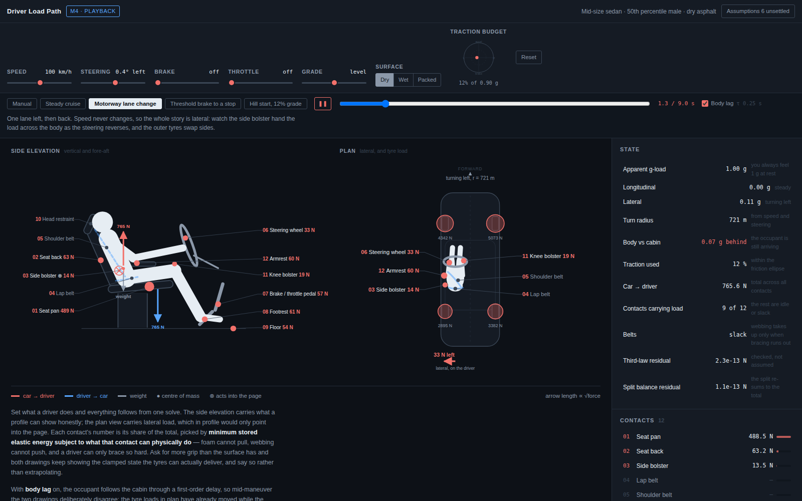
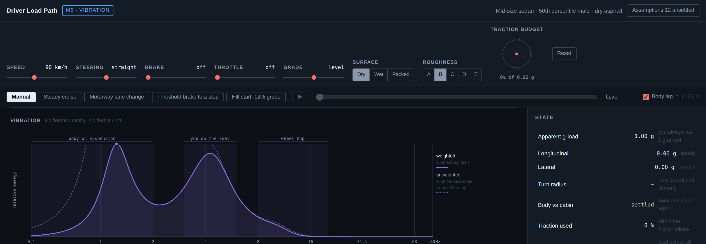

# Driver Load Path

A browser simulation of every force a car and its driver push through each other, at each of
the twelve places where they touch.

**Status: M6 judged; the view ships, the figure does not.** Three views, five live inputs, four
scripted maneuvers, a separate vibration channel, and the solver running behind them, with 212
passing tests. The full build plan is in [`PLAN.html`](PLAN.html) — open it in a browser. It carries the physics, the touchpoint
register, the architecture, the milestones, the failure modes, and the source provenance for
every default value.


## The idea

The tires generate a force at the road. That force travels up through the suspension, into the
body shell, into the seat mounts, into the foam, and finally into you. Structural engineers
call that chain the *load path*. This simulation draws it, in both directions — including the
half that driving visualizations usually skip, which is the equal and opposite force the driver
pushes back into the car.

## Scope, as decided

| Dimension | Decision |
|---|---|
| Fidelity | Real numbers, simplified model. Quasi-static rigid body vehicle, segmented occupant. |
| Views | 2D side elevation and plan view primary; 3D toggle behind a go/no-go gate. |
| Regimes | Steady cruise, cornering, braking, acceleration, road vibration. |
| Control | Live sliders plus scripted playback. |

Emergency and crash loading is explicitly **out of scope**. Different data sources, much higher
stakes on accuracy, and it deserves its own project if it is ever wanted.

## A third view, and the half of it that was cut

M6 was gated from the start: the plan said build the 3D view as a prototype and cut it if it did
not look credible beside the 2D drawings, because a body that looks wrong undermines numbers that
are right. It was built. **The verdict was a split — the view ships, the figure was cut.**

There was a figure, briefly: a stick skeleton, nineteen joints, seated driving posture, one foot
on the pedals. Rendered at six camera angles it read as an ambiguous zigzag at all six. Beside the
side elevation, which is legible in a glance, it was worse rather than better — and a viewer
squinting at a body is a viewer not reading the vector. Its two unit tests passed the entire time.
That is the part worth remembering: the tests could say the skeleton was self-consistent and could
not say it was legible, and legibility was the thing on trial.

What survived is everything that is not a body — the twelve contacts at their real positions, the
cabin planes that locate them, one force — and the thing that earned the view its place. Drawing
the resultant alone was not checkable: at 976 N with 765 N of that merely holding you up, the
arrow points nearly straight up whatever the car is doing. So the same vector is drawn three times
from one origin at one scale: whole, with the lateral axis dropped (all the side elevation can
hold), and with the vertical dropped (all the plan can hold). The projections come out visibly
shorter and pointing elsewhere, each labelled with the angle it misses. In a combined brake-and-turn
the side elevation misses 31° of the force and the plan misses 52°. That is the ⊗ in the side view,
finally measured rather than admitted.

No three.js. The projector is about a hundred lines of rotate-project-sort, which keeps the promise
that this runs from `file://` with nothing installed.

## Two views, because one cannot be honest on its own

A side elevation can show vertical and fore-aft load truthfully and **cannot show lateral load at
all** — in profile, a sideways force points into the page. That is why the bolster gets a crossed
circle there rather than an arrow. The plan view is the other half: seen from above, lateral force
has a direction again, and the contacts that only matter in a corner finally have somewhere to be
drawn properly.

The plan view also surfaces something that had been computed since M0 and never shown: the
**per-corner tyre loads**. Brake and watch the front pair swell. Turn and watch load cross to the
outside. It also shows the driver sitting well off the centreline, which is the reason the
reciprocal force is worth drawing at all.

## Five inputs, one solve

Speed, steering, brake, throttle and grade, plus the surface under the tyres. These are **driver
inputs, not accelerations** — you do not set 0.6 g of cornering, you turn a wheel at a speed and
the car works out what that costs.

Grade is real rather than faked: gravity tilts into the cabin frame, which is why a hill presses
you into the seat back while you are standing still, and why an uphill lightens the nose exactly
as throttle does. Standing on a 20% slope still reads **1.00 g** — same magnitude, pointing
somewhere else.

Everything downstream comes from one solve. The panel does not re-derive the g-load and the gauge
does not re-derive the friction utilisation. Two places computing the same number is two places to
disagree.

## Time, and the body arriving late



M4 gives the model a clock. Four maneuvers — steady cruise, a motorway lane change, a threshold
stop, a hill start on a 12% grade — are timelines of the same five driver inputs, so playback is
not a second code path. It is the existing chain with its inputs coming from a clock instead of a
thumb. Play, pause, scrub. Touch a slider and playback stops, because a running scenario is
writing to those sliders every frame and a user fighting the clock will lose.

The addition is one insertion between vehicle and occupant: the body's acceleration is a
**first-order lagged copy** of the cabin's, so the figure arrives late the way an occupant does.
Mid-maneuver the two drawings deliberately disagree — the tyre loads in plan have already moved
while the body in elevation is still coming — and the gap between them is printed as *body vs
cabin*. The tyres are not lagged; they are bolted to the car.

Three things keep that honest rather than decorative:

- **It is a transient and nothing else.** A settled state is identical with the lag on or off, to
  within 1e-6 N on every contact. That is a unit test, not a claim. The loop pins itself exactly
  on target when it settles and then stops requesting frames — 61 fps while something is moving,
  **zero when nothing is**.
- **It cannot overshoot, and a real torso does.** A first-order lag approaches monotonically. A
  body on a compliant seat is second-order and rocks past where it ends up. This model gives the
  delay and none of the rebound, which makes a hard stop look calmer than it feels. Recorded as
  `MODEL.bodyLag`, status placeholder, τ = 0.25 s.
- **Newton survives it.** The lagged body is accelerating differently from the cabin, which is the
  point; what must not change is that the force it puts into the car is the exact negative of the
  force the car puts into it. Asserted every step through a transient.

### Speed and the pedals have to agree

Speed and pedal demand are independent inputs here — nothing integrates one into the other — so a
hand-authored timeline could ask for 0.8 g of braking at a constant 100 km/h and the solver would
draw it without complaint. Rather than pretend to integrate, every preset is authored with the
arithmetic done by hand and then **checked**: each stretch of the speed profile must match the
mean acceleration the vehicle solver actually produces over that same stretch. A negative-control
test feeds it a deliberately incoherent timeline and asserts it is caught.

That check also forced a real correction to the model. A car held on the brake at a standstill was
being drawn throwing its occupant forward at 0.3 g, because `ax` is pedal *demand* and nothing
knew the car had no speed left to give. **A stopped car cannot decelerate**, so brake demand is
now suppressed at zero speed. Throttle from rest passes through, because that is how a car leaves
a standstill. The converse is not modelled and is recorded as `MODEL.stoppedCar`: a car really
held on a grade is spending longitudinal friction to stay put, and the traction gauge shows that
as zero.

## Vibration, which is a different kind of number entirely



Everything else in this app is force in newtons at one instant. Whole-body vibration is a
frequency-weighted RMS acceleration over a band — different mathematics, different units, and the
plan flagged before either half existed that merging them produces something satisfying neither.

So M5 is a **separate channel**. It takes the speed and the road roughness and nothing else. It
returns m/s² and a comfort band, never a newton, and never touches the contact split. That
separation is enforced by a test rather than by good intentions: **stepping the road class from A
to E must move no contact force by a single newton.** It gets its own hue too, because `--act` and
`--react` encode direction of action on a force, and vibration has no direction and is not a force.

The chain, and how much of each link is actually standardised:

| Stage | |
|---|---|
| ISO 8608 road class → displacement PSD | standard |
| speed → spatial to temporal frequency | exact |
| quarter car → body mode and wheel hop | **placeholder** |
| seat → occupant on the cushion | **placeholder** |
| ISO 2631-1 Wk / Wd weighting | corroborated |
| integrate → band-limited weighted RMS | exact |
| ISO 2631-1 comfort reaction band | verified |

The chart is there because the single comfort number hides the thing that makes vibration
different. Two lobes are legible on sight — the body on its suspension near 1.3 Hz and you on the
seat cushion near 4.5 Hz — with a wheel-hop shoulder near 12 Hz. The dashed trace is the same
quantity before weighting; where it runs off the top of the frame is exactly where the human
weighting is discarding the most.

### What the model got wrong, and how

The first version had **no unsprung mass**, so no wheel hop at all. Wheel hop lands inside Wk's
full-strength 4–12.5 Hz plateau, so that looked like a serious omission. Adding the missing degree
of freedom was the right fix — structure, not tuning — but the honest footnote is that it mattered
less than expected: the 8–20 Hz band carries about 14% of the weighted vertical energy and the
total moved by roughly 13%. The suspension isolates the body well at 12 Hz.

Two tests written to guard that fix were then found to be **non-diagnostic** — deleting the
unsprung mass left both green. They were rewritten against the measured separation between the
real model and a gutted one rather than against guessed thresholds, and the numbers are in the
test file so the next person can see where they came from.

### The number wears an ISO label it has not fully earned

Four of eight stages are exact or standardised. Two are representative textbook values. One is a
guessed horizontal-to-vertical input ratio that equation 7 then multiplies by 1.4. And **the
assembled chain has never been compared against a measured car** — the papers that would supply
one were unreachable from this environment.

Tuning the placeholders until the output matched a remembered figure was considered and rejected.
It would have destroyed the only useful property the number has: that nothing was bent to make it
land anywhere in particular. Instead the drawer says the chain is unvalidated end to end, the
panel reports per-axis RMS and the horizontal share so you can see how much of the headline rests
on the guess, and the spectrum is shown so the **shape** — which is the trustworthy part — is what
the eye reads first.

One more thing worth knowing: ISO's comfort bands **overlap by design**. 0.5–1.0 and 0.8–1.6 are
both listed, so 0.9 m/s² is legitimately in two at once. The app reports both, because collapsing
the overlap into one crisp label throws away the standard's own statement of how sure it is.

## Asking for more than the tyres have


Demand more grip than the surface can supply and the app does not extrapolate. The traction gauge
turns, a banner explains what happened, and **both drawings keep showing the clamped state the
tyres can actually deliver** rather than the state you asked for. Switch the surface to wet and
the same inputs jump from 67% of the budget to 175%.

## Known limitation in the anthropometry

Building M0 surfaced a contradiction the plan did not have. The occupant presets offer a 5th
percentile female, but the body-segment mass fractions they are all multiplied by come from
Dempster's 1955 sample of **nine male white cadavers**. Changing total mass does not change the
proportions, so the "female" preset is a scaled male. The caveat now travels with the numbers in
`constants.js` and prints on every report run. It must be resolved before those presets reach a
user-facing control.

## The hard part, now solved

The total force on the occupant is determined by Newton's second law. The *split* of that force
across bolster, belt, footrest, knee and wheel is not — the system is statically indeterminate.
Nothing errors when you ignore that; your code just returns whichever distribution an arbitrary
code path happened to pick.

`js/model/contacts.js` resolves it by minimum stored elastic energy, subject to what each contact
can physically do: foam pushes but never pulls, webbing pulls but never pushes, and a driver can
only brace so hard. That makes it a quadratic program rather than a linear solve.

It is not solved with a QP library. Substituting `lambda = sqrt(k) * z` turns the objective into a
plain minimum-norm problem, whose optimality conditions collapse to `z = clamp(A' y, 0, cap)` for
some `y` in three dimensions. So fourteen unknowns become a function of three, and what is left is
an unconstrained convex minimisation solved by Newton in tens of iterations. Non-negativity and
the caps hold **by construction** — they are not checked afterwards, they cannot be violated.

What that buys, visibly: the belts carry exactly zero in a car going straight, bracing absorbs a
gentle stop, and in a hard stop the bracing saturates and the shoulder belt becomes the single
largest contact on the body.

```
Scenario                pan    back   bolst  lap    shldr  wheel  pedal  foot   floor  knee
Parked                  489    63     .      .      .      33     57     61     54     .
Brisk left bend         489    63     161    .      .      33     57     61     54     226
Firm braking            367    8      79     12     467    52     52     60     41     .
Panic stop              371    .      91     118    537    61     55     64     41     .
```

Run `make loadpath-report` for the whole table. `*` marks a channel driven to its bracing limit.

## Every number carries its source

The provenance drawer ships in the same milestone as the solver, on purpose. This is the moment
the page starts putting authoritative-looking newtons next to body parts, and most of the numbers
behind them are tuned placeholders. The drawer reads the provenance registry directly, so a
constant added without a record shows up as a gap on screen rather than passing unnoticed.


Two departures from the plan happened here, both recorded in it. The solver ended up
box-constrained rather than merely unilateral, because without a ceiling on bracing it concludes
the belts never carry anything. And the stiffnesses had to be tuned to a known answer rather than
measured, because a point-mass occupant discards the limb geometry that really decides where load
goes — they are absorbing kinematics the model does not have.

## Milestones

| | | |
|---|---|---|
| **M0** | Model core, headless | **done** — 57 tests |
| **M1** | Side elevation, cruise baseline | **done** — 12 tests |
| **M2** | Contact solver and provenance drawer | **done** — 57 tests |
| **M3** | Plan view and live sliders | **done** — 10 tests |
| **M4** | Scripted playback and body lag | **done** — 26 tests |
| **M5** | Vibration overlay | **done** — 29 tests |
| **M6** | 3D toggle | **done, split** — 21 tests. View kept, body cut |

M0 deliberately had no interface. A wrong number rendered beautifully is more dangerous than a
right number rendered plainly, because the polish buys it credibility it hasn't earned.

## Running it

No build step and no dependencies to install. You need **Python 3** to serve the app and
**Node 18+** for the tests and the report — nothing else.

### macOS and Linux

```bash
make loadpath           # serve the app on http://localhost:8081
make test-loadpath      # 191 unit tests
make loadpath-report    # the headless model report, no browser needed
```

### Windows (PowerShell)

Windows has no `make`, so run the same three commands directly. Each `make` target above is a
one-liner; these are those one-liners.

```powershell
# serve the app, then open http://localhost:8081
cd apps\loadpath
python -m http.server 8081
```

```powershell
# from the repository root
node --test tests/loadpath/model.test.js tests/loadpath/touchpoints.test.js tests/loadpath/contacts.test.js tests/loadpath/scenarios.test.js tests/loadpath/vibration.test.js

node apps/loadpath/js/m0-report.js
```

Forward slashes are fine for Node on Windows. If `python` is not found, try `py -m http.server
8081`, or use Node instead: `npx --yes http-server apps/loadpath -p 8081`.

**Or skip the server entirely** and open `apps\loadpath\index.html` directly in a browser. The
app makes no network requests of any kind — no `fetch`, no `XMLHttpRequest`, no ES modules, just
plain `<script>` tags — so `file://` works. The only thing you lose is shareable deep links.

### Once it is open

| | |
|---|---|
| Sliders | speed, steering, brake, throttle, grade |
| Scenario chips | steady cruise, lane change, threshold stop, hill start &mdash; then press play |
| Scrub bar | drag to any moment in a maneuver |
| Roughness A&ndash;E | drives the vibration panel and spectrum only, never a force |
| Click any contact | what crosses it, in both directions |
| Assumptions, top right | every number that is not fully sourced |

Deep links: `?play=threshold_stop`, `?select=bolster`, `?speed=25&steerAngle=0.045`.


M1 is the reference state: a car going straight at a steady speed, which for the occupant is
indistinguishable from a car parked on level ground. Acceleration is zero, so every loaded
contact is doing one job — holding the driver up. The counter-intuitive part is that the g-load
here reads **1.00, not 0**. You always feel your own weight.

All twelve contacts are placed on real anatomy and are selectable, by mouse or keyboard. Picking
one shows what crosses it in **both** directions, which is the half most driving diagrams leave
out. A contact can be deep-linked: `index.html?select=bolster`. So can a state
(`?speed=25&steerAngle=0.045&brake=0.4`) or a maneuver (`?play=threshold_stop`), which is also how
the headless screenshot pass drives it.


Belts are drawn dashed because at rest they are slack and carrying nothing. A solid belt would
claim a load the model says is zero. The side bolster gets the drafting symbol for a vector
pointing into the page rather than an arrow, because a side view cannot honestly show a lateral
direction.

The headless report takes two options:

```bash
node apps/loadpath/js/m0-report.js --surface wet --driver f05
```

`--surface` is `dry`, `wet` or `snow`. `--driver` is `m50`, `f05` or `m95`. It exits non-zero if
the Newton's third law audit fails.

Abridged output:

```
  VEHICLE STATE
  Scenario              km/h   ax (g)   ay (g)   friction  radius    status
  Brisk left bend          79      0.00     0.51       56%  98 m      ok
  Trail braking in         79     -0.41     0.51       72%  98 m      ok
  Panic stop               90     -0.90     0.00      102%  straight  TRACTION EXCEEDED

  FORCES ON AND FROM THE DRIVER (78 kg)
  Scenario              g-load   car->body (N)              body->car (N)
  Brisk left bend         1.12   (     0,   387,   765 )    (     0,  -387,  -765 )
  Trail braking in        1.19   (  -312,   387,   765 )    (   312,  -387,  -765 )

  NEWTON THIRD LAW AUDIT — the gate for this milestone
  Worst residual across 10 scenarios: 2.542e-13 N  (Panic stop)
  Verdict: PASS
```

The report ends by printing every constant that is not yet fully sourced, so the weak numbers
are visible every time you run it rather than buried in a table.

## Layout

```
apps/loadpath/
├── PLAN.html            the build plan, start here
├── README.md
├── LEARNING.md          how the plan was reasoned out, and what to avoid
├── js/model/
│   ├── constants.js     values plus a provenance record for each
│   ├── vehicle.js       EQ 1-4: cornering, load transfer, friction ellipse
│   ├── occupant.js      EQ 5-6: segment masses, required force, third-law audit
│   ├── contacts.js      the indeterminate split, box-constrained QP
│   ├── scenarios.js     maneuvers as input timelines, and the body lag
│   ├── vibration.js     the separate frequency-domain channel
│   └── anatomy.js       where the twelve contacts are, in metres
├── js/view2d/           side elevation, plan view, spectrum, shared SVG helpers
├── js/view3d/scene.js   the resultant, and what each 2D drawing misses of it
├── js/ui/               controls, transport bar, assumptions drawer
├── js/app.js            the one solve, and the one frame loop
├── js/m0-report.js      headless harness, kept past M1
└── images/              four generated illustrations

tests/loadpath/*.test.js        at the repo root, matching gridprobe and mindmap
```

## Attribution

Prepared by David Berkowitz. Research and drafting with Anthropic Claude. Illustrations
generated with Google Gemini Nano Banana Pro (`gemini-3-pro-image-preview`); every prompt is
preserved in full in section 09 of the plan.
