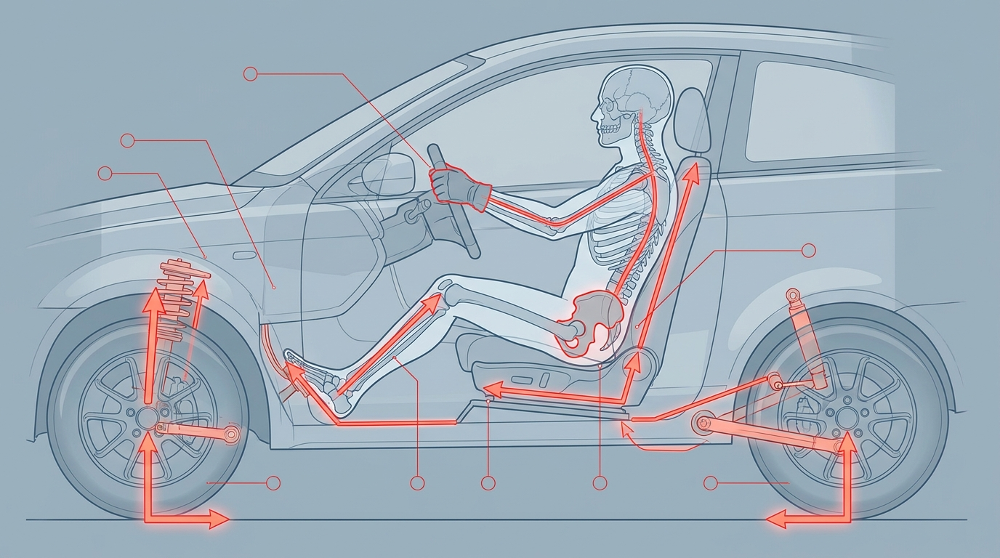
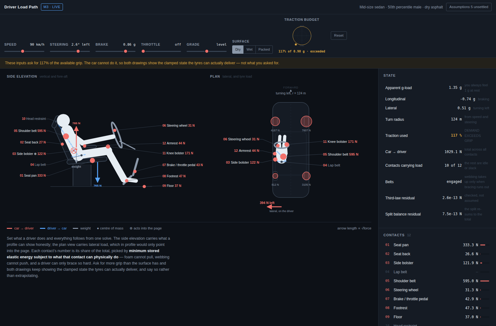
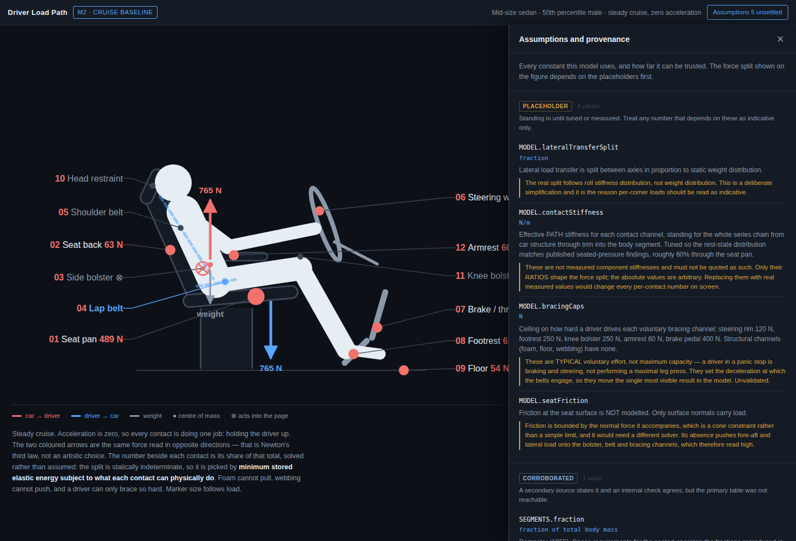
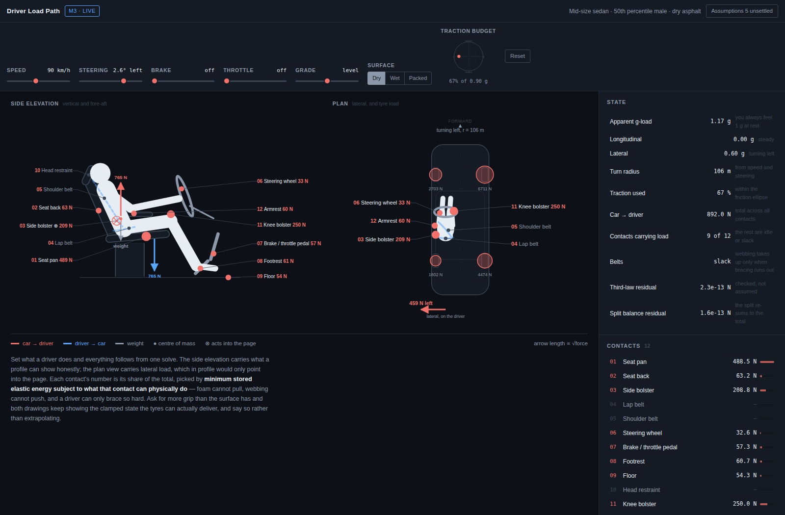
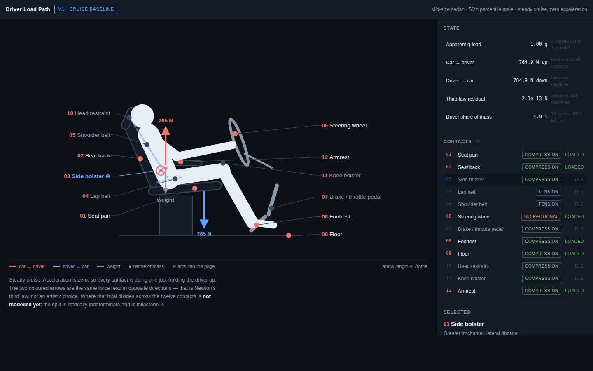

# Driver Load Path

A browser simulation of every force a car and its driver push through each other, at each of
the twelve places where they touch.

**Status: M3 built and green.** Two views, five live inputs, and the solver running behind them,
with 136 passing tests. The full build plan is in [`PLAN.html`](PLAN.html) — open it in a browser. It carries the physics, the touchpoint
register, the architecture, the milestones, the failure modes, and the source provenance for
every default value.



## The idea

The tires generate a force at the road. That force travels up through the suspension, into the
body shell, into the seat mounts, into the foam, and finally into you. Structural engineers
call that chain the *load path*. This simulation draws it, in both directions — including the
half that driving visualizations usually skip, which is the equal and opposite force the driver
pushes back into the car.

## Scope, as decided

| Dimension | Decision |
|---|---|
| Fidelity | Real numbers, simplified model. Quasi-static rigid body vehicle, segmented occupant. |
| Views | 2D side elevation and plan view primary; 3D toggle behind a go/no-go gate. |
| Regimes | Steady cruise, cornering, braking, acceleration, road vibration. |
| Control | Live sliders plus scripted playback. |

Emergency and crash loading is explicitly **out of scope**. Different data sources, much higher
stakes on accuracy, and it deserves its own project if it is ever wanted.

## Two views, because one cannot be honest on its own

A side elevation can show vertical and fore-aft load truthfully and **cannot show lateral load at
all** — in profile, a sideways force points into the page. That is why the bolster gets a crossed
circle there rather than an arrow. The plan view is the other half: seen from above, lateral force
has a direction again, and the contacts that only matter in a corner finally have somewhere to be
drawn properly.

The plan view also surfaces something that had been computed since M0 and never shown: the
**per-corner tyre loads**. Brake and watch the front pair swell. Turn and watch load cross to the
outside. It also shows the driver sitting well off the centreline, which is the reason the
reciprocal force is worth drawing at all.

## Five inputs, one solve

Speed, steering, brake, throttle and grade, plus the surface under the tyres. These are **driver
inputs, not accelerations** — you do not set 0.6 g of cornering, you turn a wheel at a speed and
the car works out what that costs.

Grade is real rather than faked: gravity tilts into the cabin frame, which is why a hill presses
you into the seat back while you are standing still, and why an uphill lightens the nose exactly
as throttle does. Standing on a 20% slope still reads **1.00 g** — same magnitude, pointing
somewhere else.

Everything downstream comes from one solve. The panel does not re-derive the g-load and the gauge
does not re-derive the friction utilisation. Two places computing the same number is two places to
disagree.

## Asking for more than the tyres have



Demand more grip than the surface can supply and the app does not extrapolate. The traction gauge
turns, a banner explains what happened, and **both drawings keep showing the clamped state the
tyres can actually deliver** rather than the state you asked for. Switch the surface to wet and
the same inputs jump from 67% of the budget to 175%.

## Known limitation in the anthropometry

Building M0 surfaced a contradiction the plan did not have. The occupant presets offer a 5th
percentile female, but the body-segment mass fractions they are all multiplied by come from
Dempster's 1955 sample of **nine male white cadavers**. Changing total mass does not change the
proportions, so the "female" preset is a scaled male. The caveat now travels with the numbers in
`constants.js` and prints on every report run. It must be resolved before those presets reach a
user-facing control.

## The hard part, now solved

The total force on the occupant is determined by Newton's second law. The *split* of that force
across bolster, belt, footrest, knee and wheel is not — the system is statically indeterminate.
Nothing errors when you ignore that; your code just returns whichever distribution an arbitrary
code path happened to pick.

`js/model/contacts.js` resolves it by minimum stored elastic energy, subject to what each contact
can physically do: foam pushes but never pulls, webbing pulls but never pushes, and a driver can
only brace so hard. That makes it a quadratic program rather than a linear solve.

It is not solved with a QP library. Substituting `lambda = sqrt(k) * z` turns the objective into a
plain minimum-norm problem, whose optimality conditions collapse to `z = clamp(A' y, 0, cap)` for
some `y` in three dimensions. So fourteen unknowns become a function of three, and what is left is
an unconstrained convex minimisation solved by Newton in tens of iterations. Non-negativity and
the caps hold **by construction** — they are not checked afterwards, they cannot be violated.

What that buys, visibly: the belts carry exactly zero in a car going straight, bracing absorbs a
gentle stop, and in a hard stop the bracing saturates and the shoulder belt becomes the single
largest contact on the body.

```
Scenario                pan    back   bolst  lap    shldr  wheel  pedal  foot   floor  knee
Parked                  489    63     .      .      .      33     57     61     54     .
Brisk left bend         489    63     161    .      .      33     57     61     54     226
Firm braking            367    8      79     12     467    52     52     60     41     .
Panic stop              371    .      91     118    537    61     55     64     41     .
```

Run `make loadpath-report` for the whole table. `*` marks a channel driven to its bracing limit.

## Every number carries its source

The provenance drawer ships in the same milestone as the solver, on purpose. This is the moment
the page starts putting authoritative-looking newtons next to body parts, and most of the numbers
behind them are tuned placeholders. The drawer reads the provenance registry directly, so a
constant added without a record shows up as a gap on screen rather than passing unnoticed.



Two departures from the plan happened here, both recorded in it. The solver ended up
box-constrained rather than merely unilateral, because without a ceiling on bracing it concludes
the belts never carry anything. And the stiffnesses had to be tuned to a known answer rather than
measured, because a point-mass occupant discards the limb geometry that really decides where load
goes — they are absorbing kinematics the model does not have.

## Milestones

| | | |
|---|---|---|
| **M0** | Model core, headless | **done** — 57 tests |
| **M1** | Side elevation, cruise baseline | **done** — 12 tests |
| **M2** | Contact solver and provenance drawer | **done** — 57 tests |
| **M3** | Plan view and live sliders | **done** — 10 tests |
| M4 | Scripted playback | next |
| M5 | Vibration overlay | |
| M6 | 3D toggle | gated, may be cut |

M0 deliberately had no interface. A wrong number rendered beautifully is more dangerous than a
right number rendered plainly, because the polish buys it credibility it hasn't earned.

## Running it

```bash
make loadpath           # serve the app on http://localhost:8081
make test-loadpath      # 69 unit tests
make loadpath-report    # the headless model report, no browser needed
```



M1 is the reference state: a car going straight at a steady speed, which for the occupant is
indistinguishable from a car parked on level ground. Acceleration is zero, so every loaded
contact is doing one job — holding the driver up. The counter-intuitive part is that the g-load
here reads **1.00, not 0**. You always feel your own weight.

All twelve contacts are placed on real anatomy and are selectable, by mouse or keyboard. Picking
one shows what crosses it in **both** directions, which is the half most driving diagrams leave
out. A contact can be deep-linked: `index.html?select=bolster`.



Belts are drawn dashed because at rest they are slack and carrying nothing. A solid belt would
claim a load the model says is zero. The side bolster gets the drafting symbol for a vector
pointing into the page rather than an arrow, because a side view cannot honestly show a lateral
direction.

The headless report takes two options:

```bash
node apps/loadpath/js/m0-report.js --surface wet --driver f05
```

`--surface` is `dry`, `wet` or `snow`. `--driver` is `m50`, `f05` or `m95`. It exits non-zero if
the Newton's third law audit fails.

Abridged output:

```
  VEHICLE STATE
  Scenario              km/h   ax (g)   ay (g)   friction  radius    status
  Brisk left bend          79      0.00     0.51       56%  98 m      ok
  Trail braking in         79     -0.41     0.51       72%  98 m      ok
  Panic stop               90     -0.90     0.00      102%  straight  TRACTION EXCEEDED

  FORCES ON AND FROM THE DRIVER (78 kg)
  Scenario              g-load   car->body (N)              body->car (N)
  Brisk left bend         1.12   (     0,   387,   765 )    (     0,  -387,  -765 )
  Trail braking in        1.19   (  -312,   387,   765 )    (   312,  -387,  -765 )

  NEWTON THIRD LAW AUDIT — the gate for this milestone
  Worst residual across 10 scenarios: 2.542e-13 N  (Panic stop)
  Verdict: PASS
```

The report ends by printing every constant that is not yet fully sourced, so the weak numbers
are visible every time you run it rather than buried in a table.

## Layout

```
apps/loadpath/
├── PLAN.html            the build plan, start here
├── README.md
├── LEARNING.md          how the plan was reasoned out, and what to avoid
├── js/model/
│   ├── constants.js     values plus a provenance record for each
│   ├── vehicle.js       EQ 1-4: cornering, load transfer, friction ellipse
│   └── occupant.js      EQ 5-6: segment masses, required force, third-law audit
├── js/m0-report.js      headless harness; goes away when app.js arrives
└── images/              four generated illustrations

tests/loadpath/model.test.js    at the repo root, matching gridprobe and mindmap
```

## Attribution

Prepared by David Berkowitz. Research and drafting with Anthropic Claude. Illustrations
generated with Google Gemini Nano Banana Pro (`gemini-3-pro-image-preview`); every prompt is
preserved in full in section 09 of the plan.
