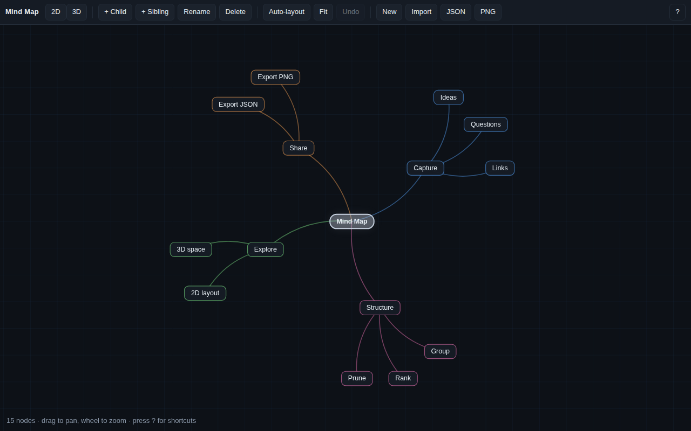
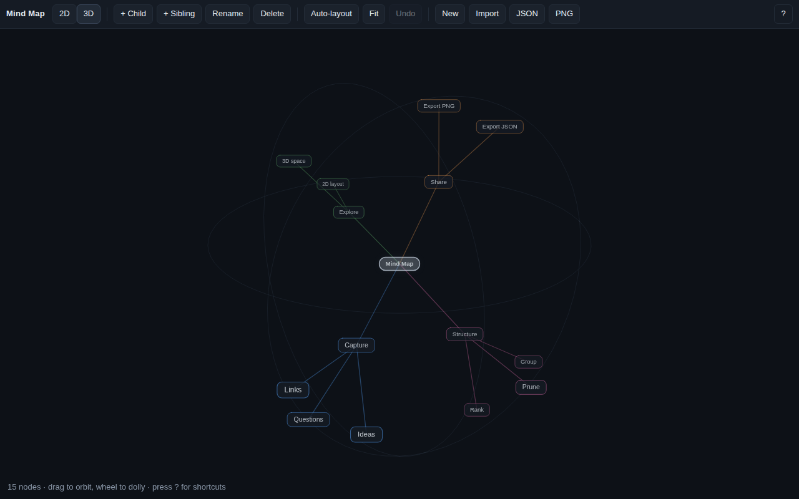

# Mind Map

A small visual mind map that draws the same tree two ways: a flat radial map,
and a spatial one you can orbit around. No build step, no dependencies — it is
plain HTML, CSS and five small scripts drawing on a canvas.

| Flat view | Orbit view |
|---|---|
|  |  |

## Run it

```bash
open apps/mindmap/index.html          # macOS; or just double-click the file
make mindmap                          # or serve it on http://localhost:8080
```

## The two spaces

Every node carries two positions: `p2` for the flat view and `p3` for the
spatial one.

- **2D** — a radial tree. Each node owns an angular slice sized by how many
  leaves hang off it, so busy branches get room and thin ones stay tight.
  The camera pans and zooms.
- **3D** — a force-directed cloud. Nodes push each other apart, edges pull
  together, and every node drifts toward the shell that matches its depth, so
  the tree's levels stay legible as rings around the centre. The camera orbits
  and dollies; distance is shown by scale and by fading.

Switching views is one animated number: screen positions are interpolated
between the two projections, so the map lifts off the plane instead of cutting
to a different picture. Both views share one renderer and one hit test.

Automatic layout leaves any node you have dragged where you put it. **Auto-layout**
(`L`) releases those and re-runs both layouts from scratch.

## Using it

| | |
|---|---|
| `Tab` | new child of the selected node |
| `Enter` | new sibling |
| `F2`, double-click | rename |
| `Delete` | remove the node and its branch |
| arrows | walk the tree |
| `2` / `3` | flat / orbit view |
| `L` / `F` | auto-layout / fit on screen |
| `Ctrl+Z` | undo |
| `?` | shortcuts panel |

Drag a node to move it (in 3D it slides along the plane facing you), hold
`Shift` and drop it on another node to re-parent its branch, drag the
background to pan or orbit, and double-click empty space to add a node there.

The map is saved to `localStorage` as you work. **JSON** and **PNG** export the
map and the current view; **Import** reads a previously exported `.json`.

## Files

```
apps/mindmap/
├── index.html      # toolbar, canvas, editor overlay, help panel
├── styles.css
└── js/
    ├── model.js    # the tree: nodes, branches, re-parenting, JSON
    ├── layout.js   # radial 2D layout, 3D seeding and force steps
    ├── camera.js   # pan/zoom camera, orbit camera, the blend between them
    ├── render.js   # canvas drawing and picking
    └── app.js      # input, view state, persistence, animation loop
```

`model.js` and `layout.js` are plain scripts with no browser dependencies;
`tests/mindmap/model.test.js` exercises them with `node --test`
(`make test-mindmap`).
